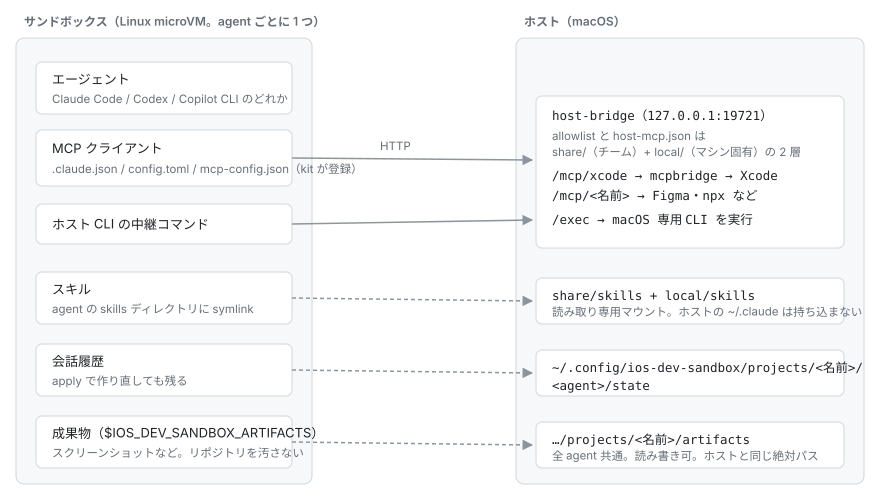

# ios-dev-sandbox

iOS プロジェクトのディレクトリで `ios-dev-sandbox` と打つと、VM の中で Claude Code が起動する。

VM を作るのは [Docker Sandboxes（sbx）](https://www.docker.com/ja-jp/products/docker-sandboxes/)。
このリポジトリが足すのは、その中から Xcode と macOS 専用の CLI を使えるようにする橋渡しと、
チーム標準の設定の配布。

## 前提条件

- Xcode 26.3+
- [mise](https://mise.jdx.dev/)

## インストール

```bash
# 1. sbx（VM を作る本体）
brew install docker/tap/sbx
sbx login

# 2. ios-dev-sandbox
git clone git@github.com:kusumotoa/ios-dev-sandbox-sample.git
cd ios-dev-sandbox-sample
mise run setup      # ビルドして ~/.local/bin に置く

# 3. 確認
ios-dev-sandbox status
```

`mise run setup` が「`~/.local/bin` が PATH にありません」と出したら、`~/.local/bin` を
PATH に足してからやり直す。書き方はシェルによる（zsh なら `~/.zshrc` に
`export PATH="$HOME/.local/bin:$PATH"`）。

## セットアップ

エージェントの認証を 1 回だけ済ませる。全サンドボックスで共有される。

```bash
ios-dev-sandbox login     # Claude Code を使う場合
```

Codex や Copilot CLI を使う場合は認証の方法が違う。
[エージェントを選ぶ](docs/instructions/agents.md)。

サンドボックス内の `git push` や `gh` には専用のトークンが要る。先に
[GitHub 認証](docs/instructions/github-auth.md)の手順で Fine-grained PAT を作ってから登録する。

```bash
ios-dev-sandbox github-login     # 作ったトークンを貼り付ける
```

コミットに GPG 署名を付けたい場合は [コミット署名](docs/instructions/commit-signing.md)。ホスト側で
署名の設定が済んでいれば追加の作業は要らない。

チームで運用するなら [推奨設定](docs/instructions/recommended.md) も見ておく。

## 使い方

```bash
cd ~/projects/my-ios-app   # .xcodeproj か .xcworkspace が要る（無ければエラーで停止）
ios-dev-sandbox
```

初回はサンドボックス作成に 1 分ほどかかる。2 回目以降は数秒で再接続し、前回の会話から続けられる。

あとは普段の Claude Code と同じ。使うコマンドは次の 2 つ。

- `host-cli.json` / `host-mcp.json` のすでにある項目を直しただけなら `ios-dev-sandbox restart-bridge`
- それ以外の設定を変えたら `ios-dev-sandbox apply`（作り直す。会話は残る）

## 設定を変える

どのファイルに何を書くかは [どのファイルに何を書くか](docs/instructions/where-to-write.md)。
自分のマシンだけで効くものと、チーム全員に配られるものに分かれている。

思ったとおりに動かないときは [うまくいかないとき](docs/instructions/troubleshooting.md)。

## 仕組み



claude / codex / copilot のどれを選んでも、Xcode の呼び出し方もチーム標準の設定の配られ方も同じ。
違うのは設定ファイルの置き場だけで、その差はこのリポジトリが吸収する。

なぜこの形にしたかは [docs/decisions.md](docs/decisions.md)。
