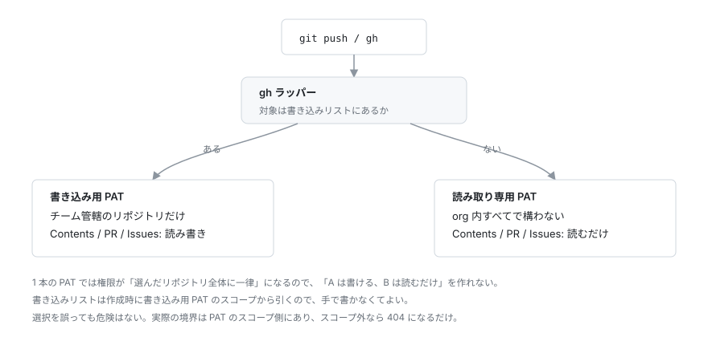

# GitHub 認証

サンドボックス内の `git push` と `gh` には、サンドボックス専用の Fine-grained PAT を使います。ホストの `gh auth token`（個人アカウントのフルスコープ）は使いません。エージェントに渡す認証情報であって、開発者本人のログインではないためです。

## 1. トークンを発行する

GitHub → Settings → Developer settings → Fine-grained tokens → Generate new token

- **Repository access**: 作業対象のリポジトリだけを選びます。All repositories は選びません
- **Expiration**: 期限を切ります。切れたら `github-login` をやり直すだけです
- **Permissions**: 下表の Repository permissions だけを付けます。Account permissions は 0 件のままにします

| 権限 | 何ができるようになるか |
|---|---|
| Contents: Read and write | `git push` / `fetch`、`gh pr merge --delete-branch` |
| Pull requests: Read and write | `gh pr create` / `ready` / `merge` |
| Issues: Read and write | `gh issue create`、`gh label list`、PR へのコメント投稿（PR は内部的に Issue） |
| Metadata: Read-only | `gh repo view`、`gh api user`。必須のため自動で付きます |

### 意図的に付けない権限

| 権限 | 付けないと何が起きるか |
|---|---|
| Workflows: Read and write | `.github/workflows/` 配下を変更する push が GitHub 側で拒否されます。CI 定義をエージェントに書き換えさせないためのガードレールです |
| Actions: Read | `gh pr checks` / `gh run list` が使えません。CI の結果を見せたい場合だけ足してください |

## 2. 登録する

```bash
ios-dev-sandbox github-login     # 発行したトークンを貼り付ける
```

トークンは sbx が預かり、どの設定ファイルにも書かれません。

サンドボックス内から見える `GH_TOKEN` はダミーの固定文字列のままです。本物の値は、サンドボックスから GitHub へ出ていく通信に sbx が差し込みます。エージェントがトークンそのものを読み出して別のサーバーへ送る、ということができません。

## 3. 確認する

`ios-dev-sandbox status` の `github (gh)` 行を見るか、サンドボックス内で `gh api user` を実行します。

## 入れ替える・止める

`github-login` をもう一度実行すると上書きされます。

**無効化したいときは GitHub 側で revoke してください。** `sbx secret rm` では、動いているサンドボックスの認証は即座には失効しません。

copilot を使うなら、この PAT に `Copilot Requests` を足します（[手順](agents/copilot.md)）。PAT を増やす必要はありません。

## 参照専用のリポジトリを読む（PAT を 2 本に分ける）

他チームのリポジトリを**読むだけ**にしたいときは、読み取り専用の PAT をもう 1 本用意します。`gh` が対象リポジトリを見て自動で切り替えます。



### 1. PAT を 2 本作る

読み取り専用の方は `Metadata: Read-only` も要ります（必須のため自動で付きます）。PR の会話コメントを読むなら Issues が要ります（PR は内部的に Issue のため）。

### 2. 登録する

sbx のサービスシークレットは**1 ドメインに 1 つ**しか持てず、`api.github.com` への認証を上書きします。2 本目を使うには、サービスシークレットをやめて両方を custom secret にします。

```bash
sbx secret set-custom --host github.com --host api.github.com \
  --env GH_TOKEN_CODE_REPOS_RW --value '<書き込み用 PAT>'
sbx secret set-custom --host github.com --host api.github.com \
  --env GH_TOKEN_CODE_REPOS_RO --value '<読み取り専用 PAT>'
sbx secret rm github --force
```

**順番を守ってください。** 先に `rm` すると、代わりが無い状態で `git` も `gh` も止まります。値はコンテナに入らず、送信時にプロキシが差し込みます。

`--value` はシェル履歴と `ps` に残ります。気になる場合は `--command` や `--ref` を使います。

### 3. 書き込み可能なリポジトリ（列挙は要りません）

一覧を手で書く必要はありません。サンドボックスの作成時に、書き込み用 PAT のスコープを GitHub へ問い合わせて作ります。

```
GET /user/repos → permissions.push が true のものを控える
```

fine-grained PAT はスコープ外のリポジトリを返さないので、この一覧は**定義上 PAT のスコープと一致します**。「一覧には載っているがスコープ外」という食い違いが起きません。

### PAT のスコープを変えたら

作成時に問い合わせるので、GitHub 側で Repository access を変えたら作り直します。

```bash
ios-dev-sandbox apply     # 会話履歴は残る
```

作成時に問い合わせが失敗した場合（通信断など）、一覧を中途半端に作らずサンドボックスの作成ごと止めます。一部のリポジトリが黙って読み取り専用になるのを避けるためです。

なお GitHub 側で**書き込み用 PAT の Repository access に選ぶのは、本当に書き込むリポジトリだけ**にしてください。読むだけのものまで選ぶと、`gh` が書き込み用を選んだ結果 404 になり、読み取り専用の PAT でなら読めたはずのものが読めなくなります。

