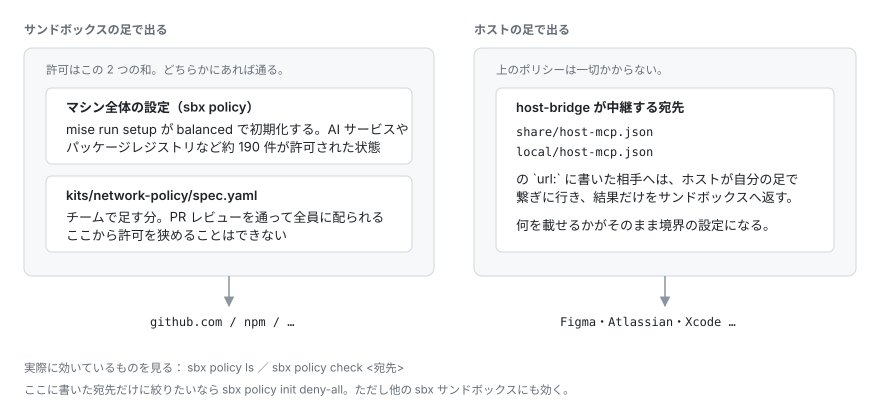

# ネットワークの許可先を増やす

サンドボックスは許可した宛先にしか出られません。許可がどこで決まるかは 2 系統に分かれます。



## チーム標準の許可先

このリポジトリの `kits/network-policy/spec.yaml` で宣言し、git pull && mise run setup で全員に配布します。**変更は PR レビューを通ります。**

```yaml
permissions:
  network:
    allow:
      - github.com
      - "*.github.com"
      - "*.githubusercontent.com"
```

書式は 3 通りです。

| 書式 | 例 |
|---|---|
| 完全一致 | `api.example.com` |
| ポート付き | `api.example.com:8080` |
| 単一ラベルのワイルドカード | `*.example.com` |

`deny` も書けて、`allow` より優先されます。

## ここに書かなくてよいもの

| 宛先 | 誰が許可するか |
|---|---|
| Anthropic 系のドメイン | sbx 組み込みの `agent: claude` kit |
| ブリッジのポート（`localhost:19721`） | `host-mcp` kit |

UDP・ICMP・SSH（:22）はそもそも開けられません。SSH は `git-https` kit が HTTPS に書き換えます。

## 実際に効いているルールを見る

```bash
sbx policy ls                     # ポリシー一覧（kit 由来 / マシン固有 / 組織）
sbx policy inspect <policy-id>    # そのポリシーの全ルール
sbx policy check <宛先>           # その宛先が通るか
```

マシン全体の設定は `mise run setup` が `balanced` で初期化するので、**普通は触りません。** ここに書いた宛先だけに絞りたい場合だけ、各自のマシンで選び直します。

```bash
sbx policy reset             # 初期化済みなので先にリセットが要る
sbx policy init deny-all     # 以降は kit で許可した宛先だけ通る
```

## 反映されるまで

`kits/network-policy/spec.yaml` は PR で変えます。手元の clone を直接書き換えると自分のマシンでは効きますが、他のメンバーには配られません。順に踏みます。

```bash
# 1. このリポジトリに PR を出してマージ
# 2. 各自のマシンで
git pull && mise run setup
ios-dev-sandbox apply     # kit は作成時固定なので作り直しが要る
```
